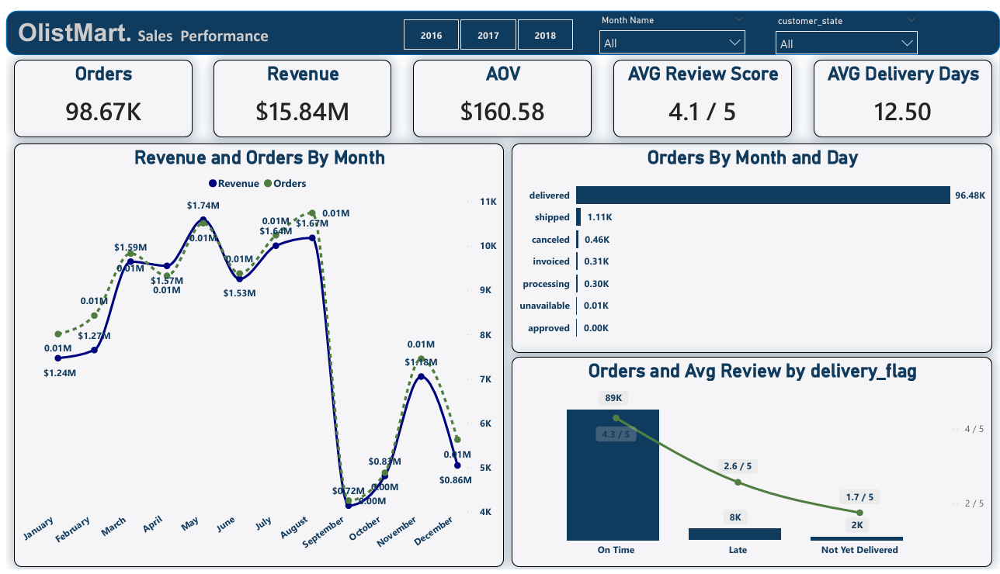
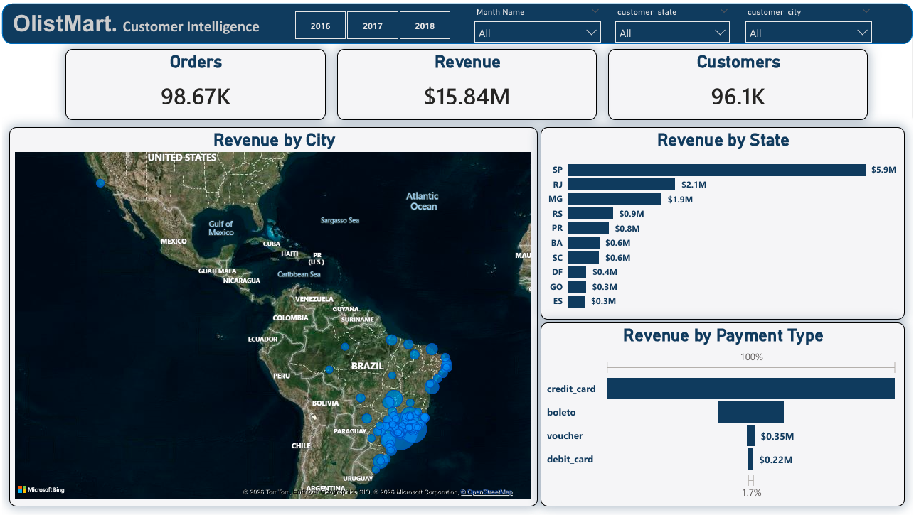
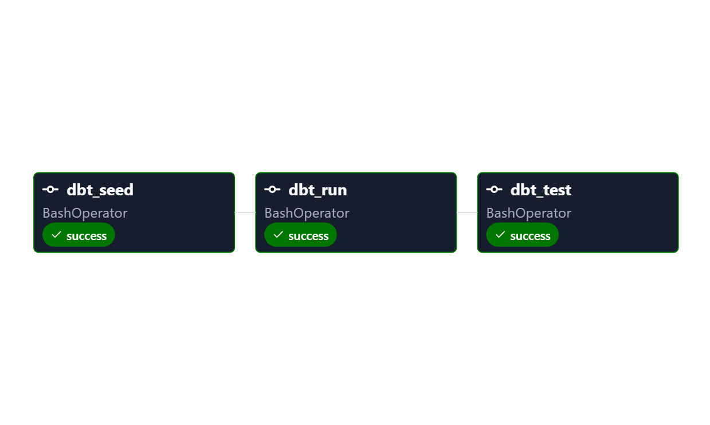

# Olist E-Commerce Analytics & Data Engineering Pipeline

## Project Overview
This project delivers an end-to-end analytics and data engineering solution built on the Olist Brazilian E-Commerce dataset. The project combines data analysis, ELT pipeline development, dimensional modeling, workflow orchestration, and business intelligence reporting to generate actionable operational and sales insights. The solution simulates a modern analytics workflow used in real-world business environments by integrating SQL, Python, dbt, Apache Airflow, and Power BI.

---
# Business Objectives 

- Analyze customer purchasing behavior
- Evaluate sales and revenue performance
- Monitor logistics and delivery efficiency
- Explore payment and installment patterns
- Identify operational bottlenecks
- Support data-driven business decisions

---
## Data Engineering 
- Apache Airflow -
- dbt -
- SQL
## Data Analytics - 
- Python (Pandas, EDA, Data Cleaning) -
- Power BI
## Databases & Development - 
- SQL Server / DuckDB -
- Git & GitHub -
- Jupyter Notebook -
- VS Code

---
# Data Engineering Architecture

The project follows a layered ELT architecture inspired by modern analytics engineering practices. ## Pipeline Workflow 1. Raw data ingestion 2. Data cleaning and validation 3. Staging transformations using dbt 4. Intermediate business transformations 5. Mart layer generation 6. Workflow orchestration using Airflow 7. Power BI reporting and visualization

## Dataset Description
The dataset represents a full e-commerce system and includes:

- Customers & geographic information  
- Orders & order status tracking  
- Order items (products, sellers, pricing, freight)  
- Payments (methods, installments, values)  
- Reviews (customer feedback)  
- Products & category translation  

---

Key Analysis Areas

## Customer Analysis
- Unique vs returning customers
- Customer distribution by state and city

## Orders & Sales Analysis
- Order volume and item distribution per order
- Average items per order
- Revenue structure (product price + freight)

## Delivery Performance
- On-time vs late deliveries
- Delivery duration vs estimated delivery time
- Delay patterns and deviations

## Payment Analysis
- Payment method distribution
- Installment usage behavior
- Payment value distribution

---

## Power BI Dashboard
An interactive dashboard was built to visualize key business insights:

- Sales performance overview  
- Customer distribution analysis  
- Delivery performance tracking  
- Geographic insights  

---

## Dashboard Preview
### Overview

### Revenue & Products

### Customers

---

# Airflow Workflow The Airflow pipeline automates: - 
- Data ingestion -
- Data transformation workflows -
- Dependency management -
- Scheduled pipeline execution
## Airflow DAG 

---

# dbt Transformation Workflow dbt was used to: - 
- Build modular SQL transformations -
- Implement staging, intermediate, and mart layers -
- Improve model maintainability -
- Create analytics-ready datasets

---

## Key Insights
- Customer concentration is higher in specific regions (especially São Paulo state)  
- Many orders contain multiple items per purchase  
- A noticeable percentage of deliveries are delayed  
- Payment installments are widely used by customers  
- Freight cost varies significantly depending on order composition  

---

## Business Value
This analysis helps businesses to:
- Improve logistics and delivery performance  
- Understand customer behavior and retention  
- Optimize pricing and shipping strategies  
- Support regional business decisions with data  
- Improve customer satisfaction and experience  

---

##  Notes
- Dataset: Olist Brazilian E-commerce Dataset (Kaggle)  
- This project focuses on real-world business analytics and decision-making insights  
- All analysis is reproducible using SQL, Python, and Power BI
